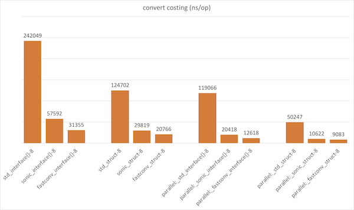

# fastconv

English | [中文](README_ZH_CN.md)

最快的 map 和 struct 互转库 🚀🚀🚀

## Features

- Zero GC, Pool & Compress, reducing small objects.
- All CPU architectures, Not for specific CPU arch.
- 10 times Faster than json Marshal / Unmarshal.
- Compatible with json tags.

## Benchmarks



## Requirements

```
go 1.21+
```

## Installation

```
go get github.com/lvan100/fastconv
```

## Examples

```
src := map / struct / slice
dst := map / struct / slice
fastconv.Convert(src, dst)
```

## Give a Star! ⭐

If you like this project, please give it a star. Thanks!

## License

FastConv is Open Source software released under the
[Apache 2.0 license](https://www.apache.org/licenses/LICENSE-2.0.html).
