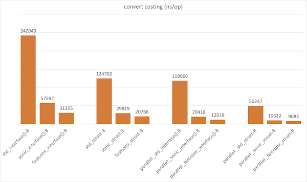

# fastconv

[English](README.md) | 中文

最快的 map 和 struct 互转库 🚀🚀🚀

## 特色

- 零 GC，缓存池 & 压缩内存，减少小对象分配。
- 全 CPU 架构，不针对特定 CPU 架构进行优化。
- 执行速度比标准库快 10 倍。
- 兼容 json 标签。

## 基准测试



## 编译

```
go 1.21+
```

## 安装

```
go get github.com/lvan100/fastconv
```

## 示例

```
src := map / struct / slice
dst := map / struct / slice
fastconv.Convert(src, dst)
```

## 点个赞吧! ⭐

如果你喜欢这个项目，请给它一颗星星。谢谢！

## 许可证

FastConv is Open Source software released under the
[Apache 2.0 license](https://www.apache.org/licenses/LICENSE-2.0.html).
